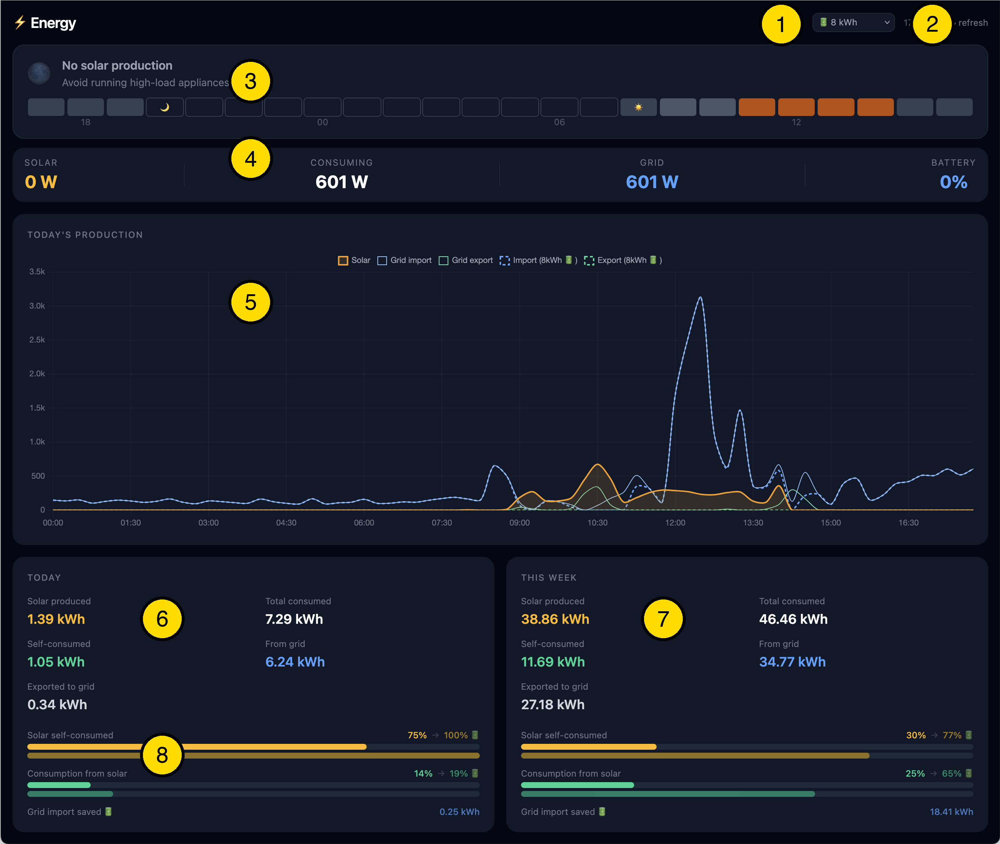

# Energy Dashboard

---

> ### ✍️ Meta-readme and disclaimer
>
> *This project was created with two goals: learning how Claude Code works and
> to, indeed, create a simple self-hosted dahboard that should give me insights
> in our solar production, solar self-consumption, grid energy import and export
> and how a home battery could increase self-consumption.*
>
> *All with an eye on the rapidly changing landscape of using LLMs to produce
> meaningful output and functional code and products and to prepare for the end
> of the so-called "Salderingsregeling" on January 1st 2027 in the Netherlands.*
>
> *I tried to be aware and careful of the output that was produced while
> "vibing". I cannot accept any liability or whatsoever when you want to
> experiment with this code.*

---

> **⚠️ Hardware & contract specific** This project is wired to specific hardware
> (P1 smart meter, SolarEdge inverter) and Dutch energy supplier APIs. Expect
> significant tinkering to adapt it to your setup. It is shared as a reference,
> not a turnkey product.

---

https://github.com/janwijbrand/solar-self-consumption-dashboard

A self-hosted solar energy monitoring dashboard for a Dutch home with SolarEdge panels.
Tracks solar production, grid import/export, models battery storage, and visualises
self-consumption vs. salderingsregeling exposure — all from your own data.

## Dashboard walkthrough



| # | Element | Description |
|---|---------|-------------|
| 1 | **Battery size** | Dropdown to select simulated battery capacity (0–30 kWh). Changes cascade live to the chart and summary panels so you can compare scenarios instantly. |
| 2 | **Time / refresh** | Shows the time of the last data fetch. Click to refresh manually; the dashboard also auto-refreshes every 60 seconds. |
| 3 | **Solar opportunity forecast** | 24-hour bar chart of expected solar potential as a percentage of the clear-sky ceiling. Orange bars = meaningful production expected; grey = little or none. Sunrise/sunset icons mark the transition. Helps decide when to run high-load appliances. |
| 4 | **Live power strip** | Real-time instantaneous readings: solar production (W), total household consumption (W), grid import or export (W), and simulated battery state of charge (%). |
| 5 | **Today's production chart** | 15-minute resolution chart for the current day. Solid lines: actual solar (amber), grid import (blue), grid export (green). Dashed lines: what import/export would look like with the selected battery size. |
| 6 | **Today summary** | kWh breakdown for today: solar produced, self-consumed, exported to grid, total consumed, and drawn from grid. |
| 7 | **This week summary** | Same kWh breakdown aggregated from Monday to now. |
| 8 | **Battery simulation bars** | Progress bars showing solar self-consumption rate and grid consumption rate — both actual (solid) and simulated with battery (→ arrow). Lets you see at a glance how much a battery would improve self-sufficiency. |

---

## Use cases

- **Self-consumption insights** — how much solar do you actually use vs. export?
- **Battery ROI** — simulate any storage size; see payback years at current prices
- **Salderingsregeling impact** — Dutch net metering ends 2027; estimate annual cost delta

---

## Architecture

```
┌─────────────────────────────────┐
│           Mac (dev)             │
│  make deploy  ──────────────►   │
└──────────────┬──────────────────┘
               │
               │ Docker SSH context (ssh://docker.host.local)
               │
               ▼
┌─────────────────────────────────────────────────────────┐
│             docker.host.local  (Raspberry Pi)           │
│                                                         │
│  ┌──────────────────┐   ┌───────────────────────────┐   │
│  │  energy-dashboard│   │  dsmr (DSMR-reader)       │   │
│  │  FastAPI + Vue   │   │  reads P1 smart meter     │   │
│  │  :8000 → Traefik │   └──────────────┬────────────┘   │
│  └────────┬─────────┘                  │                │
│           │                            │                │
│  ┌────────▼────────────────────────────▼─────────────┐  │
│  │              dsmrdb (PostgreSQL)                  │  │
│  │  solaredge.production   (15-min solar, SolarEdge) │  │
│  │  pureenergie.consumption (hourly grid, old tariff)│  │
│  │  openmeteo.hourly       (irradiance + forecast)   │  │
│  │  public.dsmr_*          (DSMR-reader's own tables)│  │
│  └───────────────────────────────────────────────────┘  │
│                                                         │
│  cron: scripts/collect.py         every 15 min          │
│  cron: scripts/collect_weather.py every 15 min          │
└─────────────────────────────────────────────────────────┘
```

---

## Solar forecast model

Element #3 in the dashboard — the 24-hour bar chart — shows expected solar potential as a
percentage of the realistic clear-sky ceiling for that time of year. Here is how it is calculated.

### 1. Plane-of-Array (POA) irradiance

Raw weather data from Open-Meteo gives irradiance on a *horizontal* surface (GHI, DNI, diffuse).
The panels are tilted at **20° facing due south**, so the actual irradiance hitting them differs —
more in winter when the low sun aligns with the tilt, potentially less at high summer noon.

[pvlib](https://pvlib-python.readthedocs.io/) converts the three irradiance components into
Plane-of-Array (POA) irradiance using the Hay-Davies transposition model, taking into account
the exact solar position for every forecast hour.

### 2. Per-month ceiling normalisation

A single annual maximum (e.g. 900 W/m²) makes winter days look perpetually poor even on a
perfectly clear day. Instead, the historical maximum POA value is computed separately for each
calendar month from the ERA5 archive. A reading of 250 W/m² POA in December is then judged
against a December ceiling (~300 W/m²) rather than a summer peak — giving a much more
informative percentage.

### 3. Temperature derating

PV panels lose efficiency as they heat up. The forecast applies a derating factor of
`1 − max(0, T − 25°C) × PANEL_TEMP_COEF` to the normalised percentage, where
`PANEL_TEMP_COEF` is the panel's power temperature coefficient (configured in `.env`).
The SunPower Max3 390W panels installed here have a coefficient of **−0.29 %/°C**, better
than the standard silicon value of −0.40 %/°C. Temperature forecast data comes from
Open-Meteo alongside the irradiance data.

### Calibration table (computed at startup)

On the first `/api/forecast` request after startup, the API joins 6+ years of 15-minute
SolarEdge production data with the hourly Open-Meteo archive to build two artefacts cached
in memory for the lifetime of the process:

- **Monthly POA ceilings** — historical maximum POA per calendar month, used for normalisation.
- **Hour × month correction table** — mean `production_W / GHI` ratio for each of the
  288 hour-of-day × month buckets. Computed for potential future use; the POA model
  already accounts for panel geometry so this is not applied on top.

---

## Prerequisites

**Hardware**
- Raspberry Pi (or similar) connected to your P1 smart meter
- SolarEdge solar inverter with monitoring enabled, Solar Edge API key

**Software on the Pi**
- Docker + Docker Compose
- [DSMR-reader](https://github.com/xirixiz/dsmr-reader-docker) running and reading the P1 port
- Python 3.11+ and a virtualenv for the collection scripts

**Accounts / APIs**
- SolarEdge monitoring account → API key (300 req/day free tier)
- Optional: hourly grid import/export export from your energy supplier (for historical data pre-DSMR)

---

## Database schemas

Run these in order against your `dsmrreader` database (or whatever database DSMR-reader uses):

```
psql -U dsmrreader_user -d dsmrreader -f sql/01_solaredge.sql
psql -U dsmrreader_user -d dsmrreader -f sql/02_pureenergie.sql
psql -U dsmrreader_user -d dsmrreader -f sql/03_openmeteo.sql
```

DSMR-reader manages its own `public.dsmr_*` tables — see that project's docs.

---

## Environment variables

Copy `.env.example` to `.env` and fill in your values:

```bash
cp .env.example .env
```

See `.env.example` for descriptions of every variable.

---

## Deployment (dashboard)

The Makefile uses a Docker SSH context so you control the Pi's Docker daemon from your Mac.

**One-time setup:**
```bash
docker context create p1 --docker "host=ssh://docker.host.local"
```

**Deploy / rebuild:**
```bash
make deploy    # docker compose up --build -d on the Pi
make logs      # tail logs
make down      # stop
make restart   # restart without rebuild
```

Docker sends the full build context to the Pi over SSH — no manual file copying needed.

The dashboard is served via Traefik on your Tailscale network (see `docker-compose.yml`).

---

## Data collection scripts

Install dependencies on the Pi:
```bash
cd ~/src/energy
python3 -m venv .venv
.venv/bin/pip install -r scripts/requirements.txt
```

Add to crontab (`crontab -e` on the Pi):
```
*/15 * * * * /home/user/src/energy/.venv/bin/python /home/user/src/energy/scripts/collect.py
*/15 * * * * /home/user/src/energy/.venv/bin/python /home/user/src/energy/scripts/collect_weather.py
```

**One-time backfills** (run once on the Pi):
```bash
.venv/bin/python scripts/backfill.py          # full SolarEdge history
.venv/bin/python scripts/backfill_weather.py  # full Open-Meteo ERA5 history
```

**CLI report:**
```bash
.venv/bin/python scripts/report.py today
.venv/bin/python scripts/report.py last-week
.venv/bin/python scripts/report.py 2025-01-01 2025-12-31
```

---

## Development

**Backend** (FastAPI, runs locally against the Pi's DB via SSH tunnel or direct access):
```bash
cd api
pip install fastapi uvicorn psycopg2-binary
uvicorn main:app --reload
```

**Frontend** (Vue 3 + Vite):
```bash
cd frontend
npm install
npm run dev     # dev server with HMR at http://localhost:5173
```

The Vite dev server proxies `/api` to `http://localhost:8000` by default.

---

## Known limitations

- **Animated dots in the Consuming card**: when solar production ramps up suddenly, the
  SolarEdge API can lag a few seconds behind the DSMR smart meter reading. This briefly
  makes computed consumption negative (physically impossible), so the value is suppressed
  and replaced with animated dots until the next consistent reading arrives.
- **Production vs. dashboard gap (~3%)**: integrated 15-min power readings vs. inverter
  energy register. Acceptable for analysis purposes.
- **Forecast calibration on first request**: the first `/api/forecast` call after a
  container restart joins years of production and weather data to build the monthly POA
  ceilings. This takes ~2 seconds and is then cached for the lifetime of the process.
