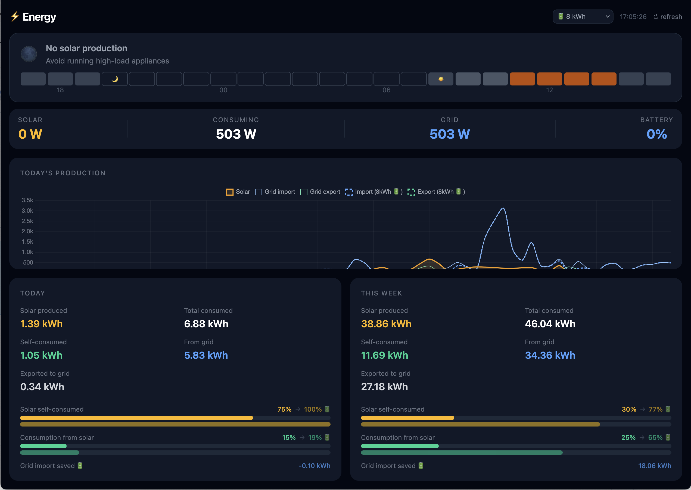

# Energy Dashboard

---

> ### ✍️ Meta-readme and disclaimer
>
> *This project was created with two goals: learning how Claude Code works and
> to, indeed, create a simple self-hosted dahboard that should give me insights
> in our solar production, solar self-consumption, grid energy import and export
> and how a home battery could increase self-consumption.*
>
> *All with an eye on the rapidly changing landscape of using LLMs to produce
> meaningful output and functional code and products and to prepare for the end
> of the so-called "Salderingsregeling" on January 1st 2027 in the Netherlands.*
>
> *I tried to be aware and careful of the output that was produced while
> "vibing". I cannot accept any liability or whatsoever when you want to
> experiment with this code.*

---

> **⚠️ Hardware & contract specific**
> This project is wired to specific hardware (P1 smart meter, SolarEdge inverter) and
> Dutch energy supplier APIs. Expect significant tinkering to adapt it to your setup.
> It is shared as a reference, not a turnkey product.

---

https://github.com/janwijbrand/solar-self-consumption-dashboard

A self-hosted solar energy monitoring dashboard for a Dutch home with SolarEdge panels.
Tracks solar production, grid import/export, models battery storage, and visualises
self-consumption vs. salderingsregeling exposure — all from your own data.



---

## Use cases

- **Self-consumption insights** — how much solar do you actually use vs. export?
- **Battery ROI** — simulate any storage size; see payback years at current prices
- **Salderingsregeling impact** — Dutch net metering ends 2027; estimate annual cost delta

---

## Architecture

```
┌─────────────────────────────────┐
│           Mac (dev)             │
│  make deploy  ──────────────►   │
└──────────────┬──────────────────┘
               │
               │ Docker SSH context (ssh://docker.host.local)
               │
               ▼
┌─────────────────────────────────────────────────────────┐
│             docker.host.local  (Raspberry Pi)           │
│                                                         │
│  ┌──────────────────┐   ┌───────────────────────────┐   │
│  │  energy-dashboard│   │  dsmr (DSMR-reader)       │   │
│  │  FastAPI + Vue   │   │  reads P1 smart meter     │   │
│  │  :8000 → Traefik │   └──────────────┬────────────┘   │
│  └────────┬─────────┘                  │                │
│           │                            │                │
│  ┌────────▼────────────────────────────▼─────────────┐  │
│  │              dsmrdb (PostgreSQL)                  │  │
│  │  solaredge.production   (15-min solar, SolarEdge) │  │
│  │  pureenergie.consumption (hourly grid, old tariff)│  │
│  │  openmeteo.hourly       (irradiance + forecast)   │  │
│  │  public.dsmr_*          (DSMR-reader's own tables)│  │
│  └───────────────────────────────────────────────────┘  │
│                                                         │
│  cron: scripts/collect.py         every 15 min          │
│  cron: scripts/collect_weather.py every 15 min          │
└─────────────────────────────────────────────────────────┘
```

---

## Prerequisites

**Hardware**
- Raspberry Pi (or similar) connected to your P1 smart meter
- SolarEdge solar inverter with monitoring enabled, Solar Edge API key

**Software on the Pi**
- Docker + Docker Compose
- [DSMR-reader](https://github.com/xirixiz/dsmr-reader-docker) running and reading the P1 port
- Python 3.11+ and a virtualenv for the collection scripts

**Accounts / APIs**
- SolarEdge monitoring account → API key (300 req/day free tier)
- Optional: hourly grid import/export export from your energy supplier (for historical data pre-DSMR)

---

## Database schemas

Run these in order against your `dsmrreader` database (or whatever database DSMR-reader uses):

```
psql -U dsmrreader_user -d dsmrreader -f sql/01_solaredge.sql
psql -U dsmrreader_user -d dsmrreader -f sql/02_pureenergie.sql
psql -U dsmrreader_user -d dsmrreader -f sql/03_openmeteo.sql
```

DSMR-reader manages its own `public.dsmr_*` tables — see that project's docs.

---

## Environment variables

Copy `.env.example` to `.env` and fill in your values:

```bash
cp .env.example .env
```

See `.env.example` for descriptions of every variable.

---

## Deployment (dashboard)

The Makefile uses a Docker SSH context so you control the Pi's Docker daemon from your Mac.

**One-time setup:**
```bash
docker context create p1 --docker "host=ssh://docker.host.local"
```

**Deploy / rebuild:**
```bash
make deploy    # docker compose up --build -d on the Pi
make logs      # tail logs
make down      # stop
make restart   # restart without rebuild
```

Docker sends the full build context to the Pi over SSH — no manual file copying needed.

The dashboard is served via Traefik on your Tailscale network (see `docker-compose.yml`).

---

## Data collection scripts

Install dependencies on the Pi:
```bash
cd ~/src/energy
python3 -m venv .venv
.venv/bin/pip install -r scripts/requirements.txt
```

Add to crontab (`crontab -e` on the Pi):
```
*/15 * * * * /home/user/src/energy/.venv/bin/python /home/user/src/energy/scripts/collect.py
*/15 * * * * /home/user/src/energy/.venv/bin/python /home/user/src/energy/scripts/collect_weather.py
```

**One-time backfills** (run once on the Pi):
```bash
.venv/bin/python scripts/backfill.py          # full SolarEdge history
.venv/bin/python scripts/backfill_weather.py  # full Open-Meteo ERA5 history
```

**CLI report:**
```bash
.venv/bin/python scripts/report.py today
.venv/bin/python scripts/report.py last-week
.venv/bin/python scripts/report.py 2025-01-01 2025-12-31
```

---

## Development

**Backend** (FastAPI, runs locally against the Pi's DB via SSH tunnel or direct access):
```bash
cd api
pip install fastapi uvicorn psycopg2-binary
uvicorn main:app --reload
```

**Frontend** (Vue 3 + Vite):
```bash
cd frontend
npm install
npm run dev     # dev server with HMR at http://localhost:5173
```

The Vite dev server proxies `/api` to `http://localhost:8000` by default.

---

## Known limitations

- **Production vs. dashboard gap (~3%)**: integrated 15-min power readings vs. inverter
  energy register. Acceptable for analysis purposes.
- **irradiance model**: uses GHI % of potential as solar proxy — a horizontal-plane
  approximation. A tilted-panel model would improve forecast accuracy.
